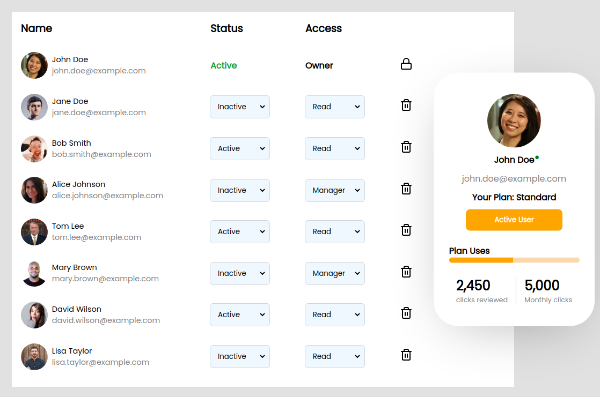

# userList-app-UI

### Live Link : [https://spiffy-douhua-350284.netlify.app/](https://spiffy-douhua-350284.netlify.app/)

### Intoduction

- The User List App displays a list of users with their basic details, such as profile,status,access.
- When the user hovers over a user profile, a card with more details about the user will be displayed on the right-hand side of the screen.

### Features :

- Displays a list of users with basic details using static dummy data.
- Displays a card with more details about the user when there is a hover event on a user item.
- The card is displayed on the right-hand side of the screen.
- The first user item in the list has "Active" as status and "owner" as access, with a lock icon displayed next to the access field.
- On changing status from active to inactive, The change will be seen on card as well.
- For Users with active status Green symbol is displayed in card.
- For Users with inactive status Red symbol is displayed in card.
- Responsiveness is added.

### Dependencies used:

- react
- react-dom
- react-feather
- @Reactjs/toolkit
- react-redux

### Components :

- UserList : contains table with list of all users
- User : Row of table, one user's data
- UserProfile : User's basic details such as name,profile image,email id
- UserCard : User's all data , displayed when row of that user gets hovered over.

### Style modules :

for each component seperate style modules are there in src/components/Component-name/Component-name.module.css

- UserList.module.css
- User.module.css
- UserProfile.module.css
- UserCard.module.css

### Folder Structure

        .
        ├── index.html
        ├── package.json
        ├── package-lock.json
        ├── public
        ├── README.md
        ├── src
        │   ├── App.css
        │   ├── App.jsx
        │   ├── assets
        │   ├── components
        │   │   ├── User
        │   │   │   ├── User.jsx
        │   │   │   └── User.module.css
        │   │   ├── UserCard
        │   │   │   ├── UserCard.jsx
        │   │   │   └── UserCard.module.css
        │   │   ├── UserList
        │   │   │   ├── UserList.jsx
        │   │   │   └── UserList.module.css
        │   │   └── UserProfile
        │   │       ├── UserProfile.jsx
        │   │       └── UserProfile.module.css
        │   ├── data
        │   │   └── userData.js
        │   ├── main.jsx
        │   └── store
        │       ├── cardSlice.js
        │       ├── hoverSlice.js
        │       └── index.js
        └── vite.config.js

### Snapshot:

